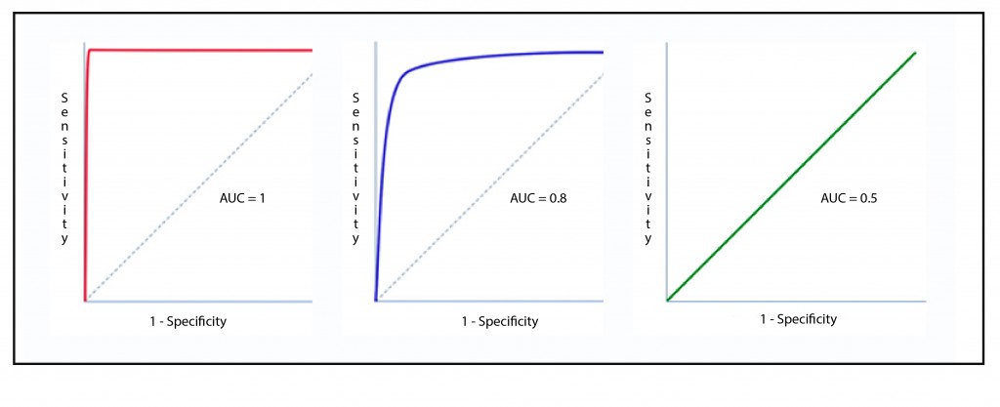

## May 8th, 2017

### Model Evaluation
There are two methods of evaluating models, Hold-Out and Cross-Validation.

#### Hold-Out
In this method, the dataset is randomly divided to three subsets:
- **Training set** is a subset of the dataset used to build predictive models.
- **Validation set** is a subset of the dataset used to assess the performance of model built in the training phase. It provides a test platform for fine tuning model's parameters and selecting the best-performing model.
- **Test set** or unseen examples is a subset of the dataset to assess the likely future performance of a model. If a model fit to the training set much better than it fits the test set, overfitting is probably the cause.

#### Cross-Validation
When only a limited amount of data is available, to achieve an unbiased estimate of the model performance we use k-fold cross-validation. In k-fold cross-validation, we divide the data into k subsets of equal size. We build models k times, each time leaving out one of the subsets from training and use it as the test set. If k equals the sample size, this is called "leave-one-out".

---

### Regression
#### Coefficient of Determination
The coefficient of determination (R-squared) summarizes the explanatory power of the regression model and is computed from the sums-of-squares terms. R-squared describes the proportion of variance of the dependent variable explained by the regression model. If the regression model is “perfect”, SSE is zero, and R-squared is 1. If the regression model is a total failure, SSE is equal to SST, no variance is explained by regression, and R-squared is zero.

#### Standardized Residuals (Errors) Plot
The standardized residual plot is a useful visualization tool in order to show the residual dispersion patterns on a standardized scale. There are no substantial differences between the pattern for a standardized residual plot and the pattern in the regular residual plot. The only difference is the standardized scale on the y-axis which allows us to easily detect potential outliers.

---

### Classification
#### Confusion Matrix
A confusion matrix shows the number of correct and incorrect predictions made by the classification model compared to the actual outcomes (target value) in the data. The matrix is NxN, where N is the number of target values (classes). Performance of such models is commonly evaluated using the data in the matrix. The following table displays a 2x2 confusion matrix for two classes (Positive and Negative).

- **Accuracy** : the proportion of the total number of predictions that were correct.
- **Positive Predictive Value or Precision** : the proportion of positive cases that were correctly identified.
- **Negative Predictive Value** : the proportion of negative cases that were correctly identified.
- **Sensitivity or Recall** : the proportion of actual positive cases which are correctly identified. 
- **Specificity** : the proportion of actual negative cases which are correctly identified. 

#### ROC curve
A curve used for evaluating results of a classification algorithm. A model that guesses randomly would always show a straight line from the origin. 

Reminder: 
 - Recall = Sensitivity = TP/(TP + FN)   
 - Specificity = TN/(TN + FP)

